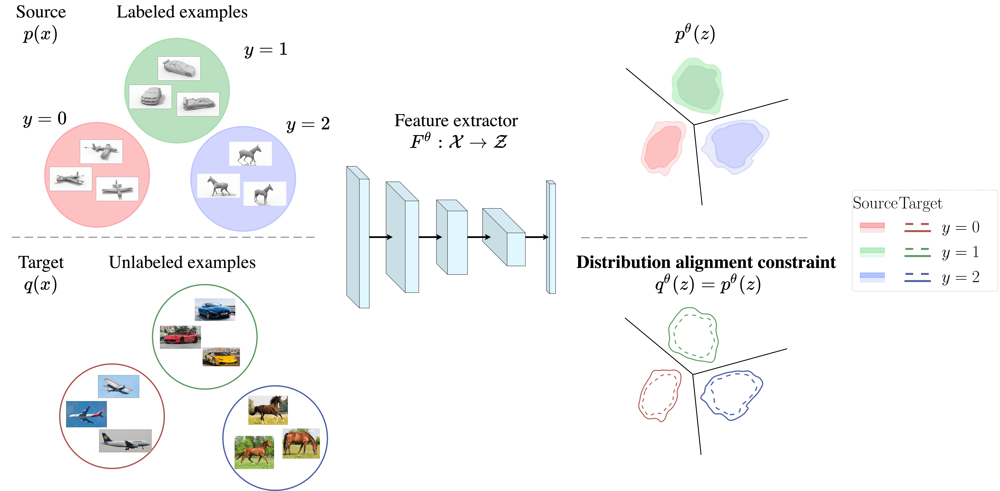
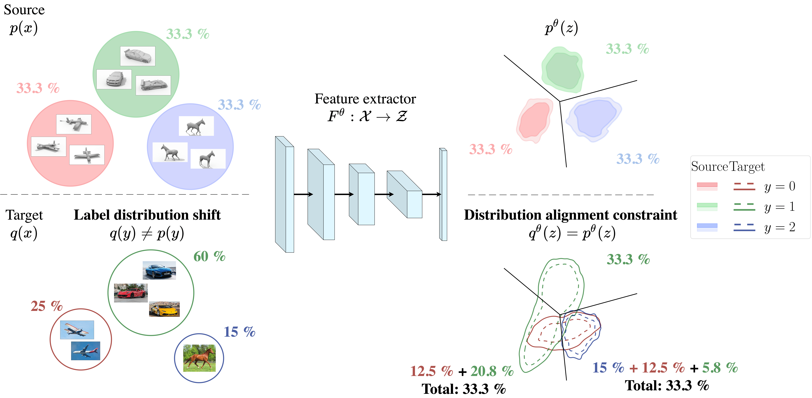
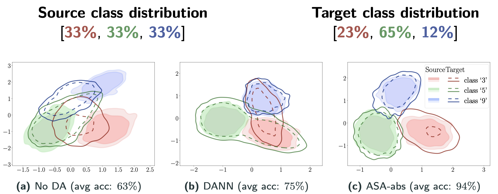

# Adversarial Support Alignment

This repository contains the code to reproduce the experiments in the paper

[Adversarial Support Alignment (ICLR 2022 spotlight)](https://openreview.net/forum?id=26gKg6x-ie)

by Shangyuan Tong, Timur Garipov, Yang Zhang, Shiyu Chang, and Tommi Jaakkola

Please cite our work if you find our results useful in your research:
```bibtex
@inproceedings{
    tong2022adversarial,
    title={Adversarial Support Alignment},
    author={Shangyuan Tong and Timur Garipov and Yang Zhang and Shiyu Chang and Tommi S. Jaakkola},
    booktitle={International Conference on Learning Representations},
    year={2022},
    url={https://openreview.net/forum?id=26gKg6x-ie}
}
```

## Overview


Distribution alignment arises as a sub-problem in several machine learning tasks, including generative models and domain adaptation.

In domain adaptation the goal is to train a classifier on a labeled source dataset, while having it perform well in the target domain utilizing the unlabeled target examples.

Methods based on distribution alignment (e.g. [DANN](https://arxiv.org/abs/1505.07818)) create a shared feature extractor, mapping examples to a representation space. 
The feature extractor has two training objectives:
* separate examples of different classes in the source domain to achieve good source classification accuracy;
* align the distributions of representations across the two domains.

This approach is illustrated in the figure below.



Recent work has demonstrated that a shift in label distributions between source and target leads to a
characterizable performance drop when the representations are forced into a distribution alignment. 
In the example below, having the representations between source and target distribution-aligned implies that some of their representations have to be matched with the wrong class.



Our work contributes to the line of work on rethinking distribution alignment. In our paper, we 
* introduce the problem of support alignment where the goal is to align only the supports of the distributions (rather than densities);
* propose a practical support alignment method called Adversarial Support Alignment (ASA). 

In experiments, we empirically compare distribution alignment and support alignment approaches on domain adaptation tasks with label distribution shift.

The figure below shows the 2D representations learned on USPS->MNIST classification task with 3-classes (digits '3', '5', '9'). The class distribution in source domain (USPS) is uniform [33%, 33%, 33%], the 
and the target (MNIST) distribution is non-uniform [23%, 65%, 12%]. We evaluated three methods: no adaptation (No DA), DANN, and our proposed ASA (ASA-abs).



Due to the label distribution shift, distribution alignment (DANN) mismatches source and target representations. Our method finds a support aligned solution with high target accuracy.

Please see the paper for more details!

# Code 

In this codebase we provide:

* Implementation of the Adversarial Support Alignment (ASA) method proposed in the paper;
* Framework for training and evaluation of domain adaptation methods under label distribution shift;
* Baseline alignment-based domain adaptation methods:
  * Distribution alignment methods: [DANN](https://arxiv.org/abs/1505.07818) , [VADA](https://arxiv.org/abs/1802.08735);
  * Relaxed distribution alignment (reweighting) methods: [sDANN](https://arxiv.org/abs/1903.01689), [IWDAN/IWCDAN](https://arxiv.org/abs/2003.04475);
* Notebooks used to produce tables and figures presented in the paper.

## Dependencies

```
torch==1.7.1
torchvision==0.8.2
Pillow==8.1.0
numpy==1.19.2
cvxopt==1.2.7

matplotlib==3.3.2
seaborn==0.11.1

tabulate==0.8.7
wandb==0.12.11
```

## Data downloading

USPS, MNIST, STL, and CIFAR10 downloading is handled by `torchvision`.

Instruction for VisDA17: https://github.com/VisionLearningGroup/taskcv-2017-public/tree/master/classification.

## File structure

```
+-- support_alignment/
|   +-- core/
|   |   +-- data/
|   |   |   +-- datasets.py (data processing utils)
|   |   |   +-- sampling.py (dataset sampling and re-weighting utils) 
|   |   +-- algorithms.py (implementation of domain adaptation algorithms)
|   |   +-- classifiers.py (classifier architercure)
|   |   +-- discriminators.py (discriminator architecture)
|   |   +-- feature_extractors.py (feature extractor architectures)
|   |   +-- importance_weighting.py (implemention of importance weighting routine used in IWDAN, IWCDAN)
|   |   +-- utils.py (training utils)
|   |   +-- vat.py (implementation of VAT loss used in VADA)
|   +-- experiment_registry/ (experiment configs)
|   |   +-- __init__.py (experiment registry class)
|   |   +-- __main__.py (experiment registry serach command line tool)
|   |   +-- exp_stl_cifar_deep_cnn.py (STL->CIFAR experiments config)
|   |   +-- exp_usps_mnist_lenet.py (USPS->MNISTS experiments config)
|   |   +-- exp_usps_mnist_lenet_2D.py (USPS->MNIST with 2D feature represenations experiments config)
|   |   +-- exp_visda17_resnet50.py (VisDA17 experiments config)
|   +-- scripts/
|   |   +-- launcher.py (Helper experiment launcher script)
|   |   +-- train.py (Main training script)
|   +-- notebooks/ (jupyter notebooks used to generate tables and figures in the paper) 
```

## Training script

Main script for training is `support_alignment.scripts.train`. Training command template:
```bash
python3 -m support_alignment.scripts.train \
  --config_name=<CONFIG_NAME> \    
  --experiment_root=<EXPERIMENT_ROOT> \
  --data_root=<DATA_ROOT> \
  [--cuda] \
  [--experiment_name_override=<EXPERIMENT_NAME_OVERRIDE>] \
  [--force_overwrite] \
  [--wb_log] \
  [--wb_projcet=<WB_PROJECT>] \
  [--wb_extra_tags=<WB_TAG_1>] \
  [...] \
  [--wb_extra_tags=<WB_TAG_N>] \
  [--wb_save_model]
```

The parameters and flags are 
* ```CONFIG_NAME``` &mdash; name of the experiment config (see config info below);
* ```EXPERIMENT_ROOT``` &mdash; path to experiment root directory which will be used to store experiment results;
* ```DATA_ROOT``` &mdash; path to data root directory where the datasets are located (torchvision datasets will be dowloaded to this location);
* ```--cuda``` (optional) &mdash; if specified the training will be run on an available cuda device;
* ```EXPERIMENT_NAME_OVERRIDE``` (optional) &mdash; if specified overrides experiment name, by default experiment name is the confing name;
* ```--force_overwrite``` (optilnal) &mdash; if specified, the experiment directory will be overwritten (if exists);
* ```--wb_log``` (optional) &mdash; if specified experiment statistics and results will be logged to [Weights&Biases](https://docs.wandb.ai/) (wandb);
* ```WB_PROJECT``` (optional) &mdash; name of wandb project (deafult: `"support_alignment"`, see https://docs.wandb.ai/ for details);
* ```WB_TAG_1, ..., WB_TAG_N``` (optional) &mdash; additional wandb tags for the experiment;
* ``--wb_save_model`` (optional) &mdash; if specified model checkpoints will be saved to wandb.

## Experiment configs

Experiment configs are stored in `support_alignment.experiment_registry.registry`. The training script
`support_alignment.scripts.train` finds a config by its name (`CONFIG_NAME`) in the registry.

### Available configs per dataset

#### USPS->MNIST

Config names defined in `support_alignment.experiment_registry.exp_usps_mnist_lenet.py`
```
usps_mnist/lenet/seed_{seed}/s_alpha_{alpha_code}/{algorithm_nickname}
```
* ```{seed}``` &mdash; run seed in range ```[1, 2, 3, 4, 5]```;
* ```{alpha_code}``` &mdash; parameter controlling level of label distribution shift (as described in the paper); codes ```[00, 10, 15, 20]``` correspond to alpha values ```[0.0, 1.0, 1.5, 2.0]```;
* ```{algorithm_nickname}``` &mdash; nickname of domain adaptation algorithm; nicknames of algorithms listed in Table 1 in the paper are (in order)
  - ```source_only```
  - ```dann```
  - ```vada```
  - ```iwdan```
  - ```iwcdan```
  - ```sdann_4```
  - ```asa_abs```
  - ```asa_sq```

**Example**: `DANN` on USPS->MNIST with alpha=2.0, seed=1
```bash
python3 -m support_alignment.scripts.train \
  --config_name=usps_mnist/lenet/seed_1/s_alpha_20/dann \    
  --experiment_root=<EXPERIMENT_ROOT> \
  --data_root=<DATA_ROOT> \
  --cuda \
  [--wb_log]  
```

Configs for USPS->MNIST experiments with 2D feature representations (Figure 2, Table D.5  in the paper) defined 
in `support_alignment.experiment_registry.exp_usps_mnist_lenet_2D.py`
```
usps_mnist_3c/lenet_2d/seed_{seed}/s_alpha_{alpha_code}/{algorithm_nickname}
```

#### STL->CIFAR

Config names defined in `support_alignment.experiment_registry.exp_stl_cifar_deep_cnn.py`
```
stl_cifar/deep_cnn/seed_{seed}/s_alpha_{alpha_code}/{algorithm_nickname}
```

Parameters ```{seed}```, ```{alpha_code}```, ```{algorithm_nickname}``` have the same possible values as in USPS->MNIST config descriptions above.

**Example**: `sDANN-4` on STL->CIFAR with alpha=0.0, seed=1
```bash
python3 -m support_alignment.scripts.train \
  --config_name=stl_cifar/deep_cnn/seed_1/s_alpha_00/sdann_4 \    
  --experiment_root=<EXPERIMENT_ROOT> \
  --data_root=<DATA_ROOT> \
  --cuda \
  [--wb_log]
```

#### VisDA17

Config names defined in `support_alignment.experiment_registry.exp_visda17_resnet50.py`
```
visda17/resnet50/seed_{seed}/s_alpha_{alpha_code}/{algorithm_nickname}
```

Parameters ```{seed}```, ```{alpha_code}```, ```{algorithm_nickname}``` have the same possible values as in USPS->MNIST config descriptions above.

**Example**: `ASA-abs` on VisDA17 with alpha=1.5, seed=1
```bash
python3 -m support_alignment.scripts.train \
  --config_name=visda17/resnet50/seed_1/s_alpha_15/asa_abs \    
  --experiment_root=<EXPERIMENT_ROOT> \
  --data_root=<DATA_ROOT> \
  --cuda \
  [--wb_log]
```

## Launcher script

`support_alignment.scripts.launcher` is a helper script which can be used to run a set of experiments in sequence with one command. The set of experiment configs to run is specified by the regex pattern. 

Launcher command template
```bash
python3 -m support_alignment.scripts.launcher --regex=<REGEX> -- <TRAIN_SCRIPT_ARGS>
```
* ```REGEX``` &mdash; regular expression used to filter configs by config names
* ```TRAIN_SCRIPT_ARGS``` &mdash; sequence of arguments to be passed to training scipts train.py (except ```CONFIG_NAME```)


**Examples**
```bash
# Run ASA-abs on USPS->MNIST for all label distribution shift levels (alpha), seed=1
python3 -m support_alignment.scripts.launcher --regex="usps_mnist/lenet/seed_1/s_alpha_../asa_abs" -- --experiment_root=<EXPERIMENT_ROOT> --data_root=<DATA_ROOT> --cuda --force_overwrite [--wb_log]

# Run No DA, DANN, SDANN-4, and ASA-abs on STL->CIFAR, alpha=1.5 for seeds in [1, 2, 3]
python3 -m support_alignment.scripts.launcher --regex="stl_cifar/deep_cnn/seed_[1-3]/s_alpha_15/(source_only|dann|sdann_4|asa_abs)$" -- --experiment_root=<EXPERIMENT_ROOT> --data_root=<DATA_ROOT> --cuda --force_overwrite [--wb_log]
```

## References

Some bits of the code were adapted from the following repositories:
* https://github.com/facebookresearch/DomainBed/
* https://github.com/microsoft/Domain-Adaptation-with-Conditional-Distribution-Matching-and-Generalized-Label-Shift/
* https://github.com/yifan12wu/da-relax
* https://github.com/ozanciga/dirt-t/
* https://github.com/lyakaap/VAT-pytorch
* https://github.com/timgaripov/swa/

Individual references for adapted pieces are provided in the code. 